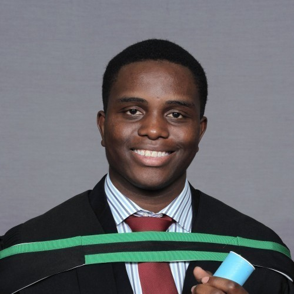

## About Me

Salut, welcome to my website! I'm Tinashe Gwatiringa, a Master's student in Cape Town. Here I tell you all about myself, from my passion for control theory to how I've had the Super Mario theme song stuck in my head for a year! Take a look at some of the projects I've worked on, or visit my  [GitHub](http://github.com/tinashe-gwatiringa) page.

## Formal Education

2016 - Present | **Master of Science in Engineering in Electrical Engineering**, *University of Cape Town*, Interested in control theory and robotics. A member of the [Mechatronics Research Group](www.mechatronics.uct.ac.za) at UCT.
2012 - 2015 | **Bachelor of Science in Engineering in Mechatronics**, *University of Cape Town*, Graduated with honours.
2009 - 2010 | **International baccalaureate**, *St John's College Harare*, Graduated with honours.
2007 - 2008 | **Cambridge IGCSE**, *St John's College Harare*, Graduated with a distinction.

## Skills

Programming Languages | C, Matlab/Simulink, LabVIEW
Operating Systems | Linux, Windows
Hardware Experience | STM32F0, GT16A, Arduino Uno

> There are 10 kinds of people in this world; those who understand binary, and those who don't.
