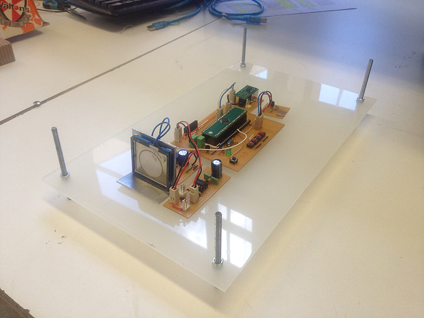
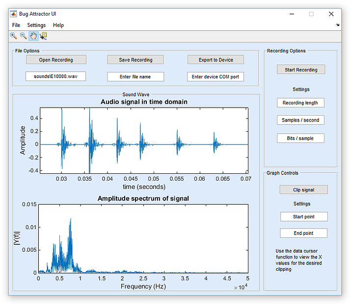
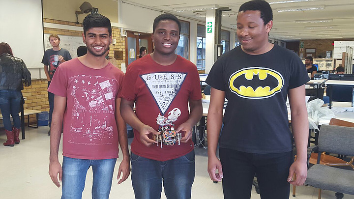
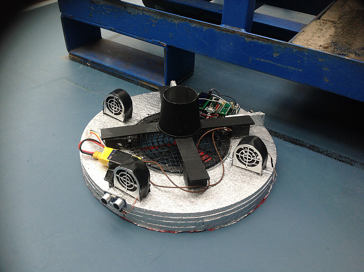

## The Bug Attractor
---

Farmed crops are lost in significant quantities each year due to a variety of pests. In South Africa, sugarcane is plagued by Eldana saccharina (E. saccharina), commonly known as the African sugarcane borer. In the 2012 season alone, R744-million of sugarcane crop was lost due to E. saccharina.

The female E. saccharina lay their eggs on the stalks of sugarcane. The damage occurs when these eggs pupate and bore into the stalk and degrade its quality. Current pest management strategies are not completely effective in minimising the E. saccharina population in sugarcane fields. A novel, more effective method of using acoustics to control pests has thus been suggested.

The mating process of E. saccharina involves the males of the species attracting females with a mating call. This call is an ultrasonic call spanning 10 kHz to 120 kHz in frequency. Using current technology, it is possible to imitate this call at low cost.

The proposed plan was to design a device that could imitate the male mating call and lure the females to traps. Reducing the population of females would result in fewer pupae boring stalks. A system to lure female E. saccharina was designed. This system included a device for recording the male calls and another device to play back those recordings. These devices were based on low cost 32-bit microcontrollers. A user interface was created using the GUIDE toolbox in Matlab. This interface was used for processing the recordings, and transferring them from the recording device to the playback device.

The design of this system was successful. However an unexpected hurdle that was not overcome in the project was the difficulty in sourcing appropriate ultrasonic transducers for the design. As a result, a prototype was built at low frequency to demonstrate the functionality of the system. This allowed for partial fulfilment of the design, leaving only the aspect of sourcing a suitable transducer. The prototype was able to save a short sound recording on its flash memory, and play it back in a similar manner to the male E. saccharina. It was concluded that given enough time to locate or build a transducer, it is possible to build the final product within the budgetary restrictions imposed.

## The OCTO8OT
---

In the fourth year of Mechatronic Engineering. In a group of 4, we were tasked with designing and constructing a walking robot capable of following a line and launching a projectile. In addition, the robot had to detect a starting race light, and also detect when it was in the zone to stop and launch the projectile. A video of the robot completing a challenge is available on [YouTube](https://youtu.be/CE4dbYZDuOY).

## The Flying Saucer
---

In the third year of Mechatronic Engineering, a group of 4 eager engineers to be we were tasked with designing and constructing a hovercraft. The outcome was a rather unique design, later dubbed "*The Flying Saucer*".

The Flying Saucer was put to the test in a race of the ages. It was tight, with the Saucer leading the pack for the majority of the time. However, due to a rather untimely battery dislogement, the victory was snatched away from team 12 at the last moment!

Though team 12 did not have the podium finish we'd hoped for, many lessons were drawn from this exercise of taking ideas and making them into something real.
